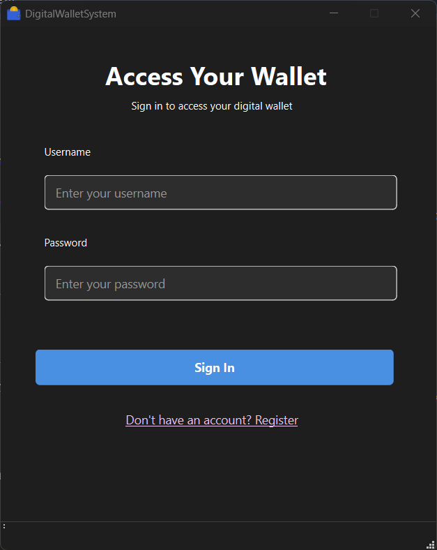
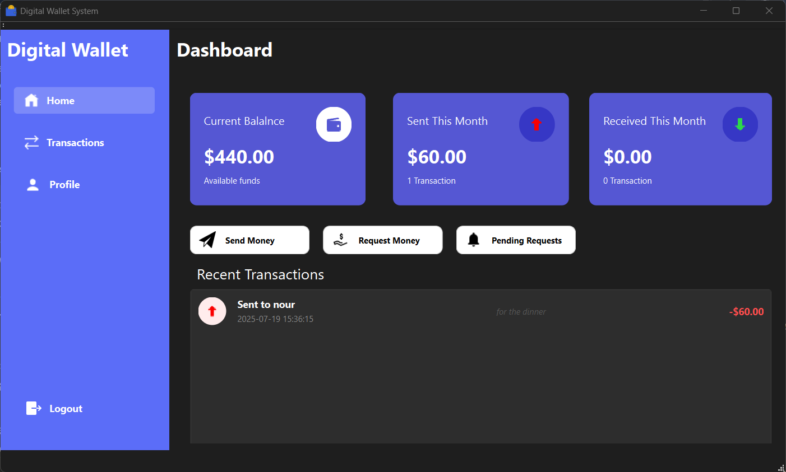
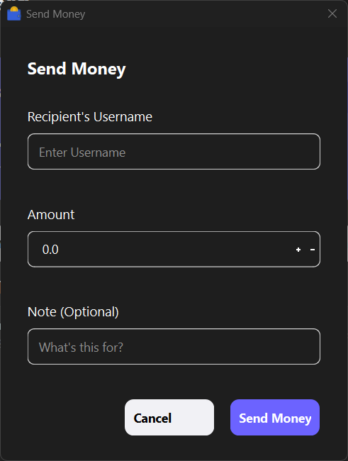
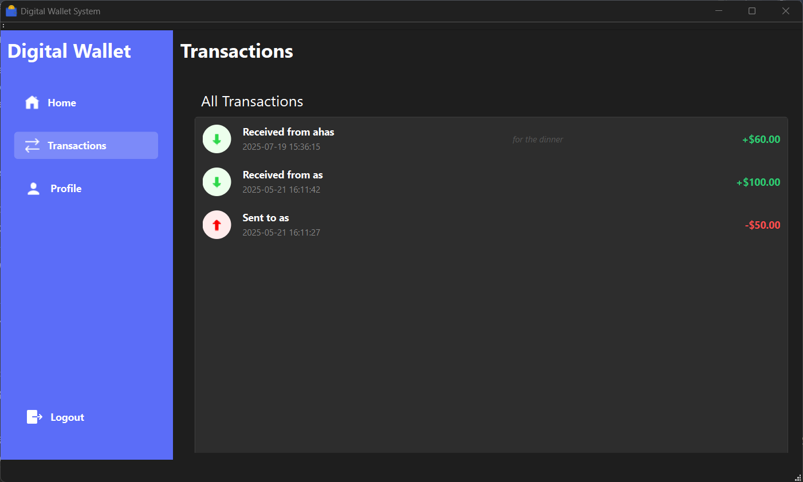
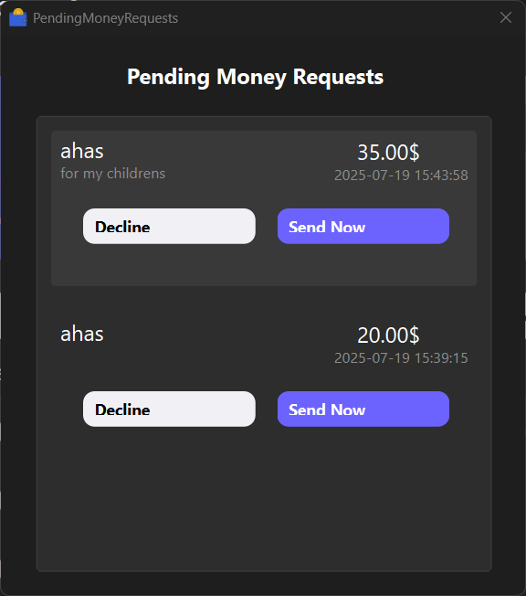
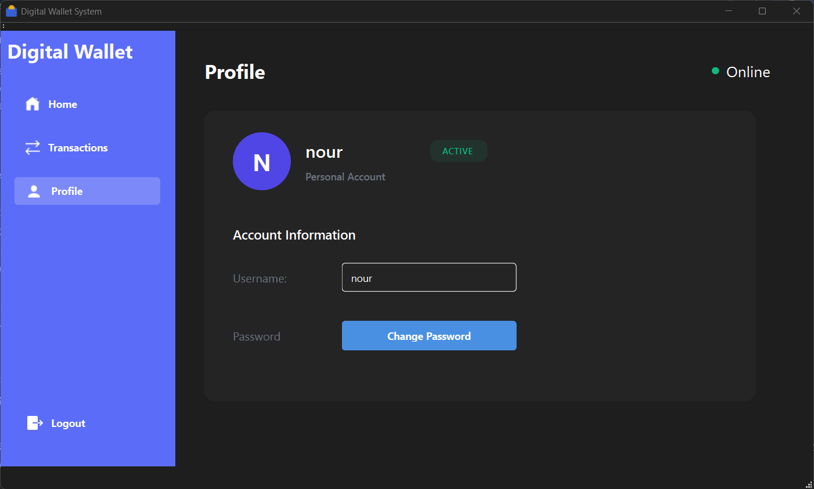
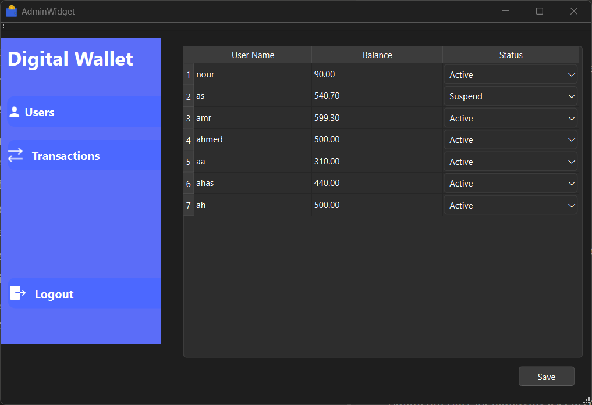
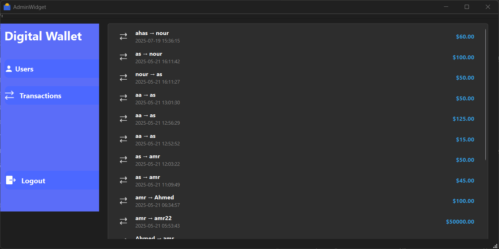

# Digital Wallet System
A C++ implementation of a digital wallet system allowing users to register, send and receive money, manage balances, and track transaction history in a secure environment.

## Project Overview
This project implements a simplified version of a digital wallet system that enables users to perform basic financial transactions and manage their balance within a secure environment. Each user has an account that can hold a balance, send money to other users, and receive money. All transactions are secure and require user authentication.

## Features
### User Functionalities
- Register and create an account with a unique username and secure password
- Log in to account with secure authentication
- View current balance
- Send money to other users
- Request money from other users
- View transaction history (sent and received)
- Edit user profile (e.g., change password)

### Admin Functionalities
- Secure login using username and password
- View list of all registered users (usernames, balances, transaction history)
- Add, edit, delete, or suspend user accounts
- View all system transactions (sender, recipient, amount, date/time)
- Adjust user balances

### Security Features
- Password cipher encryption for secure storage
- Transaction validation to prevent overdrafts
- Immediate balance updates for all transactions
- Suspended accounts cannot perform transactions until reactivated

## Screenshots
### User Interface
#### Login Screen

*Secure user authentication with username and password validation*

#### User Dashboard

*Main user interface showing current balance and quick action buttons*

#### Send Money

*Interface for sending money to other users with transaction validation*

#### Transaction History

*Complete record of sent and received transactions with timestamps*

#### Money Requests

*View and manage pending money requests from other users*

#### User Profile

*User interface for managing user accounts and changing passwords*

### Admin Interface
#### Admin Dashboard

*Administrative overview with system statistics and user management tools*

#### System Transactions

*Complete system transaction log for administrative oversight*

> **Note**: Screenshots are stored in the `screenshots/` directory. Make sure to capture high-quality images that clearly demonstrate each feature of the application.

## Technical Implementation
### Data Structures
The system uses the following STL data structures:
- **unordered_map**: Used for storing user information and fast lookup by username
- **list**: Used for maintaining transaction history, allowing efficient insertion at the beginning for recent transactions

### Core Components
- **Models**: Contains core data structures and business logic
  - `clsUser.h`: User account management and authentication
  - `clsTransaction.h`: Transaction handling and validation
  - `clsAdmin.h`: Admin functionality implementation
  - `clsDatabase.h`: Data persistence and retrieval
  - `clsMoneyRequest.h`: Money request functionality

## Error Handling
The system implements basic error handling for:
- Insufficient balance attempts
- User not found scenarios
- Authentication failures
- Invalid transaction amounts

## Data Persistence
All user data and transactions are saved to files, allowing users to close the program and reopen it with their data intact.

## Development Tools
- **Language**: C++
- **IDE**: Visual Studio
- **UI Framework**: Qt (implied by widget structure)

## Usage
### Regular User
1. Register a new account or login
2. Navigate the dashboard to view balance and transaction history
3. Use "Send Money" to transfer funds to another user
4. Use "Request Money" to request funds from another user
5. Check "Pending Requests" to manage money requests

### Admin
1. Login with admin credentials
2. Access admin dashboard to view all system data
3. Manage user accounts and transactions

## Installation and Setup
1. Clone the repository
2. Open the project in Visual Studio
3. Build and run the application
4. Create a `screenshots/` directory in the project root for documentation images

## Contributors
- Ahmed Alian
- Amr Ahmed
- Omar Elsheikh

---
*This project was developed as part of educational coursework*
